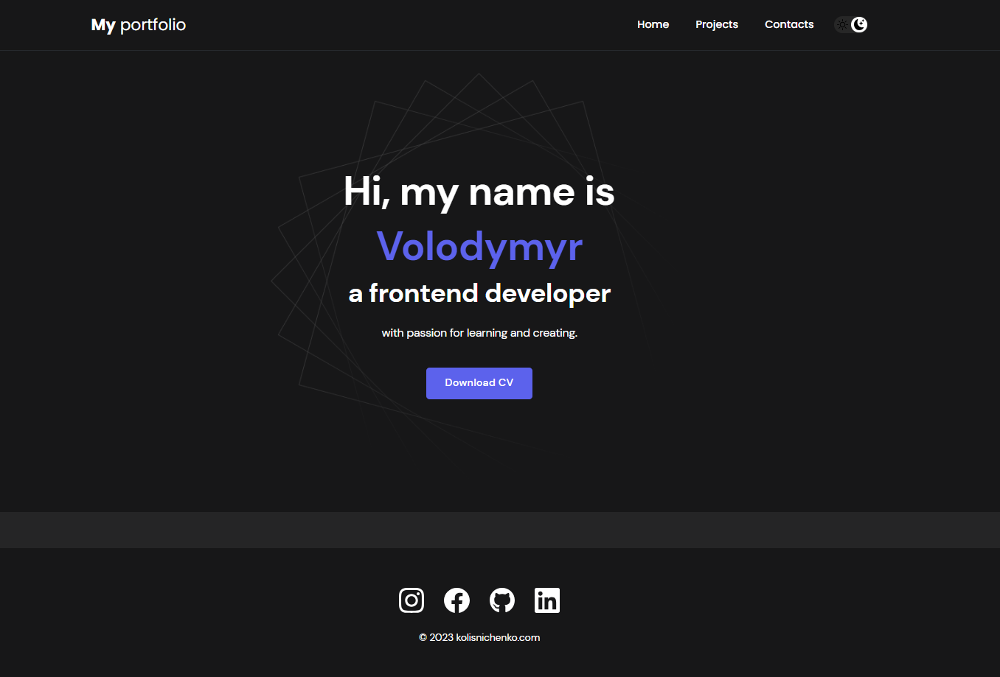

<h1>Portfolio Website</h1>

This is the repository for my personal portfolio website. The portfolio showcases my skills, projects, and experiences to provide an overview of my professional profile. The website is designed to be visually appealing, user-friendly, and informative.

<h2>Live Website</h2>
Visit my portfolio website at https://volodymyrkolisnichenko.github.io/portfolio to explore my work.

<h2>Features</h2>
<b>Home: </b>An introduction to who I am and my areas of expertise. 
<b>Projects:</b> Displaying a selection of my projects with descriptions, screenshots, and links. 
<b>Skills:</b> Highlighting the technical skills and tools I am proficient in. 
<b>Experience: </b>Listing my work experience and accomplishments. 
<b>Contact: </b>Providing a means to get in touch with me. 

<h2>Technologies Used</h2>
<b>HTML:</b> Markup language for creating the structure and content of the website. 
<b>CSS:</b> Stylesheets for defining the visual appearance and layout of the website. 
<b>JavaScript: </b>Programming language used for interactivity and dynamic elements. 
Other libraries or frameworks: The project may utilize additional libraries or frameworks for specific functionalities or design enhancements. Refer to the project's source code for more details.
<h2>Usage</h2>
To view the website locally, follow these steps: 

<h3>Clone the repository:</h3>
git clone https://github.com/VolodymyrKolisnichenko/portfolio.git 
<h3>Navigate to the project directory:</h3>
cd portfolio 
Open index.html in your web browser to access the website. 
<h2>Contributing</h2>
Contributions are not currently accepted for this project, as it represents my personal portfolio. However, your feedback and suggestions are always welcome!

<h2>Contact</h2>
For any inquiries or professional opportunities, please feel free to reach out to me through my portfolio website or via GitHub.
